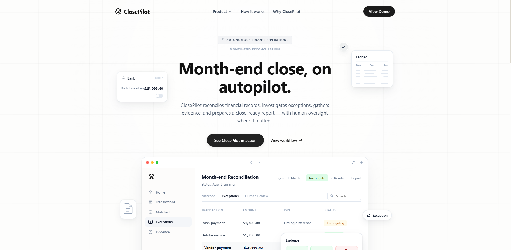
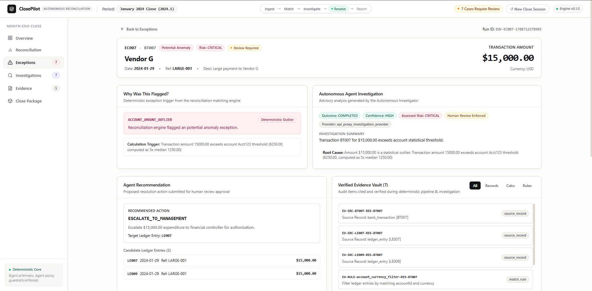
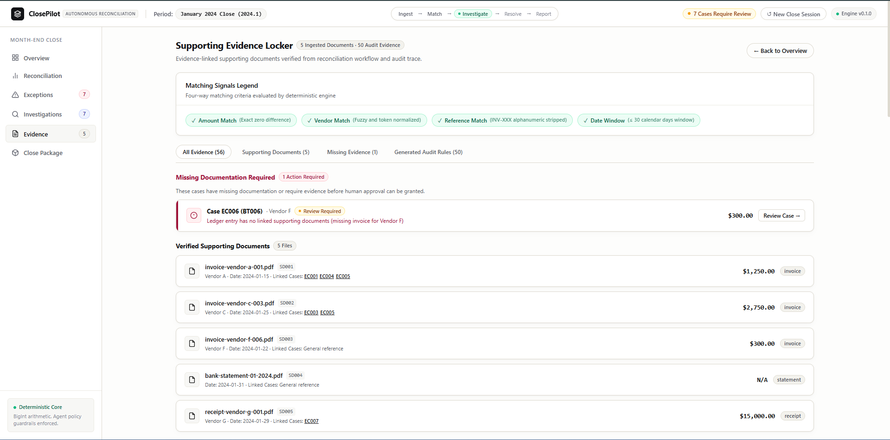
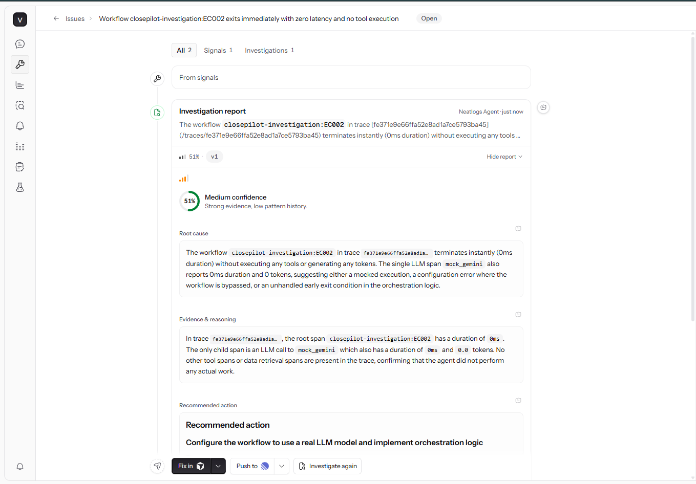
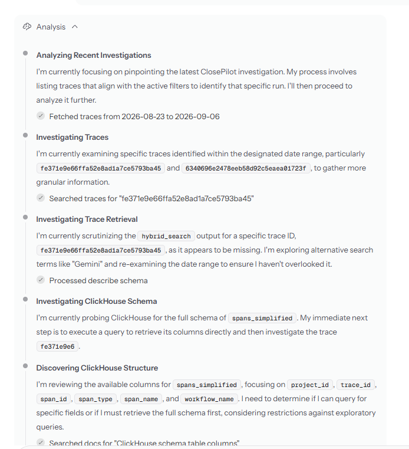
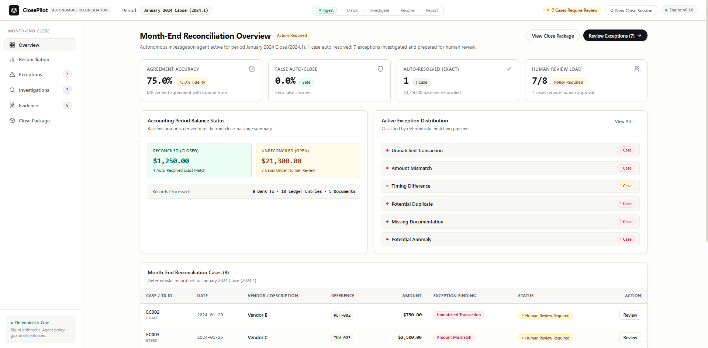
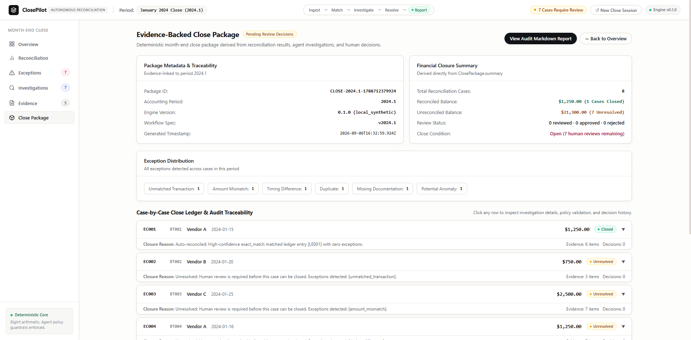
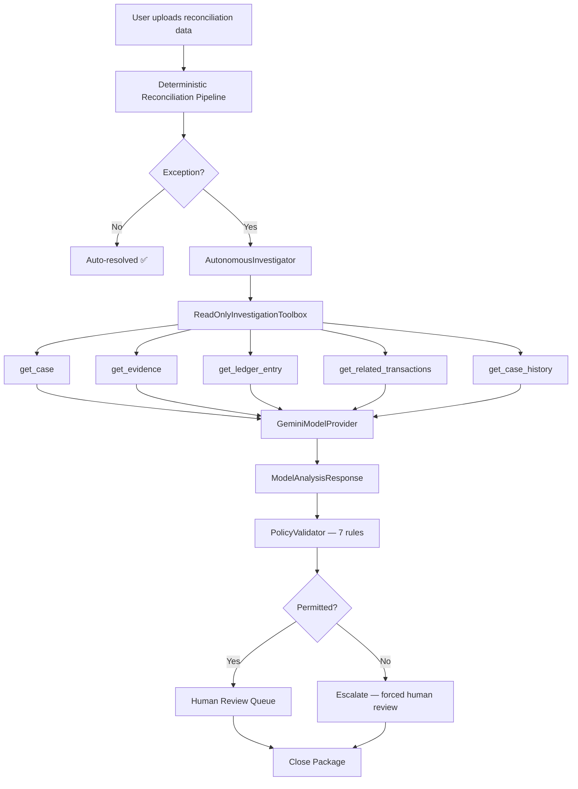
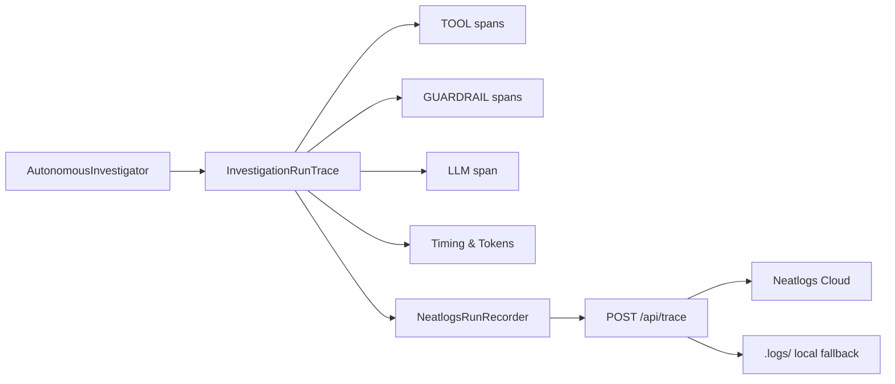

# ClosePilot

> **An autonomous month-end reconciliation agent that matches financial records, investigates discrepancies, resolves safe exceptions, escalates uncertain cases for human approval, and produces an evidence-backed close package.**

| | |
|---|---|
| 🌐 **Live Demo** | [close-pilot-zeta.vercel.app](https://close-pilot-zeta.vercel.app/) |
| 🎬 **Demo Video** | [▶ Watch the ClosePilot Demo — Coming Soon](DEMO_VIDEO_URL_HERE) |
| 🏆 **Track** | Autonomous Office of the CFO |
| 📁 **Repository** | [github.com/vanshdhiwar09/ClosePilot](https://github.com/vanshdhiwar09/ClosePilot) |


---

## The Problem

Month-end close is one of the most time-intensive processes in finance operations. Every cycle, teams must:

- Match bank statement lines against general ledger entries
- Investigate discrepancies that the rules engine cannot automatically resolve
- Collect supporting evidence (invoices, receipts, statements)
- Decide case-by-case whether exceptions can be cleared or need controller escalation
- Assemble a compliant close package documenting every decision

This is largely manual, error-prone, and blocks the close process when exceptions pile up.

---

## The ClosePilot Approach

```
INGEST → MATCH → INVESTIGATE → RESOLVE → REPORT
```

ClosePilot automates the **investigation** step. The deterministic reconciliation engine finds exceptions; the autonomous agent investigates each one using read-only tools; a policy layer decides what is safe to resolve; and a human reviewer approves the outcome.

**The LLM investigates. It doesn't control the books.**

Deterministic accounting logic remains the authoritative source of truth throughout. The agent is advisory.


*ClosePilot overview dashboard*

---

## Why This Is an Agent

A simple classifier cannot investigate a reconciliation exception. It can only label it. An agent can:

- Read the full case context (transaction, candidates, exceptions, evidence)
- Look up specific ledger entries and linked documents
- Search for related transactions by vendor or amount
- Inspect the case's human review history
- Reason across all of this before making a recommendation

The investigation loop:

```
Financial records
        ↓
Deterministic reconciliation pipeline
        ↓
Exception detected → case created
        ↓
AutonomousInvestigator
        ↓
Read-only investigation toolbox (5 tools)
        ↓
Gemini structured reasoning
        ↓
Structured ModelAnalysisResponse (JSON)
        ↓
Deterministic PolicyValidator (7 safety rules)
        ↓
Evidence citation integrity check
        ↓
Safe auto-resolution  OR  Human review queue
        ↓
Evidence-backed close package
```

### The Five Read-Only Investigation Tools

| Tool | What It Does |
|---|---|
| `get_case` | Full case context: bank transaction, reconciliation result, exceptions, candidate entries, evidence, rule trace, review history |
| `get_evidence` | Retrieves specific evidence items by ID; validates every reference |
| `get_ledger_entry` | Fetches a ledger entry and its linked supporting documents |
| `get_related_transactions` | Searches for related ledger entries by vendor, reference token, amount, or date window using deterministic normalization |
| `get_case_history` | Returns the complete human review decision audit trail for a case |

All five tools are **strictly read-only**. The agent cannot create, modify, or delete any financial record.

---

## Safety & Human-in-the-Loop

This is the most important part of the architecture.


*Exception investigation with evidence and policy trace*

### Deterministic Policy Guardrails

Before any agent recommendation can affect the workflow, `PolicyValidator` evaluates it against seven deterministic rules:

| Rule | What It Prevents |
|---|---|
| `EVIDENCE_CITATION_INTEGRITY` | Agent citing evidence IDs that do not exist in the case |
| `AUTO_RESOLVE_GUARD` | Marking a case with open exceptions as no-action-required |
| `UNMATCHED_TRANSACTION_GUARD` | Approving a match when no candidate ledger entry exists |
| `MISSING_DOCUMENTATION_GUARD` | Approving a match while required documentation is absent |
| `AMBIGUOUS_CANDIDATES_GUARD` | Autonomously approving when multiple competing entries exist |
| `HIGH_VALUE_ANOMALY_GUARD` | Classifying a statistical anomaly as low risk |
| `ACCOUNTING_STANDARD_CLEARANCE` | All exception cases enforce human review regardless of recommendation |

**The LLM investigates; deterministic controls decide what is allowed.**

### Human Review

All exception investigations produce `requiresHumanReview: true`. Reviewers can:

- **Approve** — accept the agent's recommendation
- **Reject** — reject and flag for re-investigation
- **Request Evidence** — trigger evidence collection before deciding

High-value transactions (e.g. flagged as `potential_anomaly`) cannot be auto-resolved even with an exact ledger match. The policy layer enforces escalation.


*Evidence-backed investigation with citation trail*

---

## Live LLM — Gemini Integration

ClosePilot uses a fully live Google Gemini integration for production investigations.

### Secure Architecture

```
Browser
  └─▶ /api/investigate   (Vercel serverless function)
          └─▶ GeminiModelProvider
                  └─▶ Gemini REST API
                          └─▶ Structured JSON response
                  └─▶ ModelAnalysisResponse
          └─▶ PolicyValidator
          └─▶ InvestigationResult
  ◀─────────────────────────────
```

**The Gemini API key never reaches the browser.** It is held exclusively in the serverless function environment. The browser calls `/api/investigate`; the server calls Gemini.

### Model Configuration

| Setting | Value |
|---|---|
| Provider | `GeminiModelProvider` (native REST, zero dependencies) |
| Default model | `gemini-flash-lite-latest` (configurable via `GEMINI_MODEL`) |
| Response format | `application/json` (structured output) |
| Temperature | `0.1` |
| Server timeout | 25 000 ms |

### Verified Live Investigation (BT102)

A real BT102 investigation was executed end-to-end against the live Gemini API and verified:

| Metric | Measured Value |
|---|---|
| Investigation duration | ~1.88 s |
| Total tokens | 1 274 |
| Tool calls | 5 |
| Policy evaluations | 1 |
| Neatlogs spans | 7 |

*These are measurements from a single verified test run, not guaranteed production benchmarks.*

---

## Observability — Neatlogs

Every autonomous investigation produces a structured `InvestigationRunTrace` that is forwarded to Neatlogs via a secure server-side proxy.

### Trace Structure

Each trace captures:

- **Root span** — workflow name, case ID, bank transaction ID, outcome, total duration
- **TOOL spans** — one per tool call: name, input, output, duration
- **GUARDRAIL spans** — one per policy evaluation: rule, permitted/blocked, reason
- **LLM span** — model name, provider, recommendation, confidence, risk level, token usage

### Secret Safety

All traces are scrubbed before storage. Patterns matched:
- Google API keys (`AIza…`)
- Neatlogs tokens (`nl_…`)
- Bearer authorization headers

### Browser → Server Architecture

```
Browser (NeatlogsRunRecorder)
  └─▶ POST /api/trace   (Vercel serverless function)
          └─▶ Neatlogs ingest endpoint
          └─▶ Local .logs/ fallback (non-fatal, ephemeral on Vercel)
```

The browser never holds the Neatlogs API key.

### The Failure We Found — and Fixed

During development, Neatlogs showed a suspicious trace:

```
provider: mock_gemini
duration: 0 ms
tokens:   0
tools:    0
```

Investigation revealed the cause: a unit test for `NeatlogsRunRecorder` was constructing the recorder without explicitly passing `apiKey: ""`. Because an empty string is falsy, it fell back to reading `NEATLOGS_API_KEY` from the real `.env` file — and sent a mock trace to the live Neatlogs project.

**The fix:** test cases now pass `apiKey: ""` explicitly. The recorder constructor was updated to distinguish between "no key provided" and "empty key explicitly set." The `loadLocalEnv()` auto-call was moved to be conditional on `hasExplicitKey`.

After the fix, a live Gemini run was re-recorded with correct telemetry:

```
provider: gemini_rest_provider_gemini-flash-lite-latest
duration: 1 880 ms
tokens:   1 274
tools:    5
spans:    7
```

This is the **Observe → Find Failure → Fix → Verify** loop in practice.


*Live Gemini investigation trace in Neatlogs*


*Neatlogs exposing the mock trace — the failure that triggered the fix*

---

## Built with AO

AO (Antigravity / Google's autonomous coding agent) was used as the primary development partner throughout the project.

### Development Workflow

```
Goal
  ↓
AO session (architecture / implementation)
  ↓
Code produced and tested
  ↓
Test results reviewed
  ↓
Failures identified
  ↓
AO session (diagnosis / fix)
  ↓
Verified
```

### Areas Where AO Was Used

| Phase | AO Contribution |
|---|---|
| Architecture | Designed the deterministic reconciliation / advisory agent separation |
| Data & evaluation | Built the fixture schema, ground truth format, and evaluation harness |
| Reconciliation engine | Implemented the matching pipeline, exception detection, and evidence vault |
| Agent layer | Built `AutonomousInvestigator`, `ReadOnlyInvestigationToolbox`, `PolicyValidator` |
| Gemini integration | Designed the secure server-side API boundary and `GeminiModelProvider` |
| Observability | Designed and implemented `InvestigationRunTrace`, `NeatlogsRunRecorder`, and the `/api/trace` proxy |
| Reliability | Diagnosed the Neatlogs test leak, fixed recorder isolation, and verified the live trace |
| CI/CD | Created the GitHub Actions pipeline and Vercel deployment configuration |

AO sessions were iterative — each session produced implementation, tests were run, failures were analyzed, and the next session addressed them.


*AO sessions used during ClosePilot development*


*AO diagnosing a failure and producing a fix*

---

## Product Walkthrough

### Overview Dashboard


The overview shows reconciliation totals, exception counts, and evaluation metrics derived from the active dataset.

### Reconciliation View



Uploaded reconciliation data becomes the active dataset. The pipeline runs deterministically and populates transaction status, exception types, and candidate matches.

### Exception Detail


Each exception case shows the bank transaction, candidate ledger entries, detected exception types, and the agent investigation result including tool calls, policy evaluations, and the final recommendation.

### Evidence Locker


The evidence view shows all supporting documents associated with a case. The agent's evidence citations are validated against this set — hallucinated evidence IDs are rejected by `EVIDENCE_CITATION_INTEGRITY`.

### Close Package



The close package assembles every resolved and reviewed case into a structured report with decision history, evidence references, and rule traces — ready for controller sign-off.

---

## Demo Scenario

The synthetic dataset used in the live demo contains three cases:

| Transaction | Amount | Outcome | Notes |
|---|---|---|---|
| **BT101** | $1,200 | ✅ Auto-resolved | Exact match — no exceptions, no LLM call required |
| **BT102** | $3,500 bank / $3,400 ledger | 🔍 Human review | $100 variance investigated by live Gemini |
| **BT103** | $15,000 | 🔒 Human review enforced | Exact ledger match found, but `HIGH_VALUE_ANOMALY_GUARD` prevents auto-resolution |

BT103 demonstrates a key design decision: **an exact match is not sufficient justification for autonomous approval when the transaction is a statistical outlier.** The policy layer forces human review regardless of the match quality.

---

## Evaluation

### Canonical Evaluation (Fixture 2024.1)

| Metric | Value |
|---|---|
| Total evaluation cases | 8 |
| Strict agreement with ground truth | **6 / 8 (75.0%)** |
| Fixture version | `2024.1` |

**Why 6/8 and not 8/8?**

Cases EC005 (duplicate) and EC007 (potential anomaly) have candidate ledger entry ID inconsistencies between the fixture data and the ground truth file. The reconciliation engine produces valid, internally consistent outputs for these cases — but the expected `candidateLedgerEntryIds` in the ground truth do not match the IDs that the deterministic matcher surfaces.

The decision was made to **preserve the generalised matching algorithm** rather than hardcode fixture-specific exceptions to force agreement. This is the correct engineering choice: evaluation accuracy reflects real agreement, not adjusted agreement.

### Custom Live Demo Dataset

| Metric | Value |
|---|---|
| Cases | 3 |
| Auto-resolved | 1 (BT101 — $1,200) |
| Requiring human review | 2 (BT102 + BT103 — $18,500) |
| Total transaction value | $19,700 |
| Ground truth supplied | None — this is a demonstration dataset |
| Agreement accuracy | N/A (no ground truth) |

### Live BT102 Investigation (Observed Measurement)

| Metric | Value |
|---|---|
| Duration | ~1.88 s |
| Total tokens | 1 274 |
| Tool calls | 5 |
| Policy evaluations | 1 |

---

## Architecture

### Investigation Pipeline



### Observability Pipeline



### Production API Boundary

```
Browser
  ├─▶ POST /api/investigate → GeminiModelProvider → Gemini REST
  └─▶ POST /api/trace       → Neatlogs ingest / local fallback

GEMINI_API_KEY    — server-side only
NEATLOGS_API_KEY  — server-side only
```

---

## Tech Stack

| Layer | Technology |
|---|---|
| UI | React 19, TypeScript |
| Build | Vite 5 |
| Styling | Vanilla CSS |
| Icons | lucide-react |
| Schema validation | Zod |
| LLM | Google Gemini REST API (native `fetch`, zero SDK dependency) |
| Observability | Neatlogs (`neatlogs` npm package + custom recorder) |
| Analytics | Vercel Analytics |
| Testing | Vitest |
| CI | GitHub Actions |
| Hosting | Vercel (serverless functions for `/api/*`) |

---

## CI / CD

### GitHub Actions

Every push and pull request to `main` runs:

```yaml
npm ci
npm test        # 246 tests
npm run typecheck
npm run build
```

Tests run **fully offline** — no Gemini or Neatlogs keys are required in CI. `GeminiModelProvider` defaults to `DeterministicMockProvider` when no API key is present.

See [`.github/workflows/ci.yml`](.github/workflows/ci.yml).

### Vercel Deployment

Vercel deployment is configured manually via the Vercel dashboard (not triggered by GitHub Actions). The [`vercel.json`](vercel.json) configuration:

- Routes `/api/investigate` → `api/investigate.ts` serverless function (30 s max)
- Routes `/api/trace` → `api/trace.ts` serverless function (10 s max)
- Routes everything else → `dist/index.html` (SPA fallback)

---

## Local Development

### Prerequisites

- Node.js ≥ 18
- npm

### Setup

```bash
git clone https://github.com/vanshdhiwar09/ClosePilot.git
cd ClosePilot
npm install
```

### Environment Variables

Copy `.env.example` to `.env` and fill in your values:

```bash
cp .env.example .env
```

```env
# Server-side only — never prefix with VITE_
GEMINI_API_KEY=
GEMINI_MODEL=gemini-2.5-flash
CLOSEPILOT_USE_LIVE_LLM=true

# Optional — traces fall back to local .logs/ if absent
NEATLOGS_API_KEY=
```

> **Important:** These variables are consumed by Vite's dev-server middleware (`vite.config.ts`) and by Vercel serverless functions (`api/`). They are never bundled into the browser.

### Run

```bash
npm run dev       # starts Vite dev server at http://localhost:5173
```

### Test

```bash
npm test          # runs 246 unit tests (no API keys required)
npm run typecheck # TypeScript strict check
npm run build     # production build to dist/
```

---

## Live Demo

**[https://close-pilot-zeta.vercel.app/](https://close-pilot-zeta.vercel.app/)**

To walk through the investigation workflow:

1. Click **"Load Demo Dataset"** to load the synthetic reconciliation dataset
2. Explore the **Overview** tab — transaction totals and exception counts
3. Open the **Reconciliation** tab — see matched and exception cases
4. Click an exception case to trigger an **autonomous investigation**
5. Review the tool trace, policy evaluation, and agent recommendation
6. Approve or reject from the **Human Review** panel
7. Export the **Close Package** when done

> The demo uses synthetic financial data only. It does not connect to any real bank or accounting system.

---

## Demo Video

**[▶ Watch the ClosePilot Demo — Coming Soon](DEMO_VIDEO_URL_HERE)**

---

## Project Updates

**X / Twitter:** [X_POST_URL_HERE](X_POST_URL_HERE)

---

## Hackathon Submission

| | |
|---|---|
| **Track** | Autonomous Office of the CFO |
| **Problem** | Month-end reconciliation and exception handling — a high-stakes, repetitive, manual finance process |
| **Solution** | Autonomous investigation with deterministic financial controls and mandatory human review |
| **AO** | Used throughout development: architecture, implementation, diagnosis, and iterative improvement |
| **Neatlogs** | Agent observability, trace storage, failure discovery, and live verification |
| **Gemini** | Server-side structured investigation reasoning with 0.1 temperature and JSON output |
| **Evaluation** | 6/8 canonical case agreement (75.0%) — limitations documented, not hidden |

---

## Repository Structure

```
api/                    # Vercel serverless endpoints
  investigate.ts        # /api/investigate → Gemini
  trace.ts              # /api/trace → Neatlogs

src/
  agent/                # AutonomousInvestigator, tools, policy, Gemini provider
  evaluation/           # Evaluation harness and metrics
  observability/        # InvestigationRunTrace, recorders, Neatlogs integration
  reconciliation/       # Deterministic matching pipeline
  review/               # Human review state machine and close package
  schemas/              # Zod schemas for all domain types
  server/               # Server-side request handlers
  ui/                   # React app, views, data adapter
  workflow/             # End-to-end reconciliation workflow

data/
  fixtures/             # Synthetic reconciliation datasets
  ground-truth/         # Expected outcomes for evaluation

tests/unit/             # 246 unit tests
docs/                   # Architecture, observability, screenshots
.github/workflows/      # CI pipeline
```

---

*ClosePilot — Autonomous month-end reconciliation. Built for the Autonomous Office of the CFO track.*
